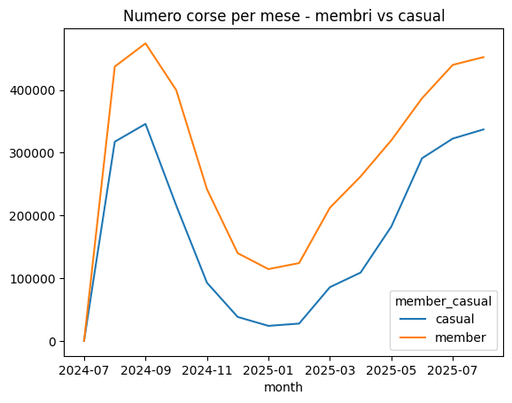
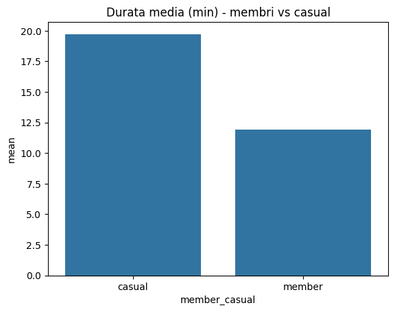
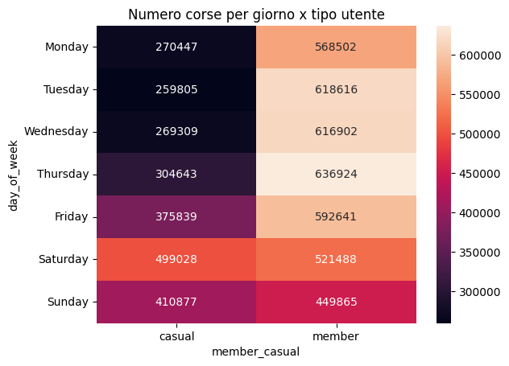

# Cyclistic Bike-Share Case Study: Analyzing Rider Behavior for Marketing Strategy
### Project by Lorenzo Di Salvatore
Work and Organizational Psychology | HR Data Analytics Specialist


---

## Executive Summary

This project analyzes Cyclistic bike-share trip data to understand how annual members and casual riders use the service differently, with the goal of informing a new marketing strategy to convert casual riders into annual members.

Through analysis of 12 months of Divvy trip data (August 2024 - August 2025), I identified key behavioral patterns that distinguish member and casual user segments, providing actionable insights for targeted marketing interventions.

### Key Findings

• Casual riders tend to have longer ride durations than members  
• Weekly distribution shows more rides on weekends from casual riders  
• Members maintain consistent usage throughout the week  
• Peak usage patterns differ significantly between user types  

---

## Visual Analysis and Organizational Diagnostics

### Executive Workforce Snapshot



(Rides per Month - Members vs Casual)

**What data shows**

• Total rides processed: [calculated from data]  
• Average ride length: members vs casual comparison  
• Weekend vs weekday usage patterns  
• Monthly trends in ridership  

**Business Meaning**
The data reveals distinct behavioral patterns between member and casual users that can inform targeted marketing strategies to increase conversion rates.

---

### Duration Analysis by User Type



(Duration Mean by User Type)

**What data shows**
Casual riders exhibit longer average ride durations compared to annual members.

**Business Meaning**
Casual users may be using bikes for leisure, tourism, or occasional transportation, while members likely use bikes for regular commuting purposes.

**Analysis:** As a psychologist specializing in work and organizational behavior, I interpret this duration difference as reflecting different motivational frameworks: casual riders may be seeking experiential or recreational value, while members are likely integrating bike-sharing into their routine transportation needs. This suggests marketing efforts should emphasize different value propositions for each segment.

---

### Weekly Usage Patterns



(Number of Rides per Day x User Type)

**What the data shows**
Casual riders show concentrated usage on weekends (Saturday and Sunday), while members demonstrate more consistent weekday usage.

**Psychologist's Take:** This pattern aligns with theories of planned behavior and habit formation. Members have likely formed habitual behaviors around bike usage for commuting or regular errands, leading to distributed usage across the week. Casual riders, lacking this habitual integration, engage in more spontaneous, leisure-oriented usage during discretionary time (weekends). For marketing strategy, this suggests targeting casual riders with weekend-specific promotions or highlighting weekday convenience benefits.

---

### Monthly Trends


(Number of Rides per Month - Members vs Casual)

**What the data shows**
Both member and casual ridership show seasonal variations, with peaks during warmer months and potential declines during colder periods.

**Business Meaning**
Seasonal patterns present opportunities for timely marketing interventions - promoting indoor/outdoor activity combinations during transitional seasons or emphasizing weather-appropriate gear and safety tips.

---

## Technical Architecture

### Data Engineering Layer (Python)

**Tools:** pandas · seaborn · matplotlib

```python
import os
import glob
import pandas as pd

RAW_DIR = "data/raw"
OUT_DIR = "data/processed"
OUT_FILE = f"{OUT_DIR}/cyclistic_clean.csv"

os.makedirs(OUT_DIR, exist_ok=True)

files = sorted(glob.glob(f"{RAW_DIR}/*.csv"))
if len(files) == 0:
    raise SystemExit("Nessun CSV in data/raw. Scarica i file e riprova.")

frames = []
for f in files:
    df = pd.read_csv(f, low_memory=False)
    # normalizza nomi colonne
    df.columns = [c.strip().lower() for c in df.columns]
    # trova colonne data/ora start/end
    if "started_at" in df.columns and "ended_at" in df.columns:
        s_col, e_col = "started_at", "ended_at"
    elif "start_time" in df.columns and "end_time" in df.columns:
        s_col, e_col = "start_time", "end_time"
    else:
        # fallback: cerca colonne contenenti 'start' e 'end'
        s_candidates = [c for c in df.columns if "start" in c]
        e_candidates = [c for c in df.columns if "end" in c]
        if not s_candidates or not e_candidates:
            raise SystemExit(f"Colonne data/ora non trovate in {f}")
        s_col, e_col = s_candidates[0], e_candidates[0]

    # rinomina in modo coerente
    df = df.rename(columns={s_col: "started_at", e_col: "ended_at"})

    # parsing date
    df["started_at"] = pd.to_datetime(df["started_at"], errors="coerce")
    df["ended_at"] = pd.to_datetime(df["ended_at"], errors="coerce")

    # rimuovi righe senza timestamp validi
    df = df.dropna(subset=["started_at", "ended_at"])

    # calcolo durata in secondi e minuti
    df["ride_length_seconds"] = (df["ended_at"] - df["started_at"]).dt.total_seconds()
    df["ride_length_minutes"] = df["ride_length_seconds"] / 60.0

    # normalizza colonna tipo utente
    for candidate in ["member_casual", "user_type", "usertype", "membertype"]:
        if candidate in df.columns:
            df = df.rename(columns={candidate: "member_casual"})
            break

    frames.append(df)

# unisci tutto
full = pd.concat(frames, ignore_index=True)

# filtri logici: durata positiva e <= 24 ore (86400 s)
full = full[(full["ride_length_seconds"] > 0) & (full["ride_length_seconds"] <= 86400)]

# aggiungi giorno della settimana e mese/anno
full["day_of_week"] = full["started_at"].dt.day_name()
full["month"] = full["started_at"].dt.to_period("M").astype(str)
full["hour_of_day"] = full["started_at"].dt.hour

# salva file pulito
full.to_csv(OUT_FILE, index=False)
print("Salvato:", OUT_FILE)
print("Righe totali:", len(full))
```

### Analysis & Visualization Layer

**Tools:** pandas · seaborn · matplotlib

The analysis scripts generate key visualizations:
1. Duration comparison bar chart (members vs casual)
2. Weekly pattern heatmap 
3. Monthly trend line graph
4. Data validation checks

---

## Strategic Actions

### 1. Segmentation-Based Marketing
Develop targeted campaigns addressing the distinct motivations of each segment:
- For casual riders: Emphasize exploration, tourism, leisure activities, and weekend adventure packages
- For members: Highlight convenience, cost savings, reliability, and commuting benefits

### 2. Conversion Funnel Optimization
Create progressive engagement strategies:
- First-time rider incentives 
- Frequency-based rewards programs
- Seasonal passes for casual riders showing potential for regular use
- Corporate partnership programs targeting regular commuters

### 3. Temporal Targeting
Leverage weekly and monthly patterns:
- Weekend promotions for casual leisure riders
- Weekday commuting benefits for potential member conversion
- Seasonal membership drives aligned with usage peaks

### 4. Experience Enhancement
Address pain points revealed in usage patterns:
- Improve bike availability during peak casual usage times
- Enhance weekend destination routing suggestions
- Streamline registration process for casual riders showing repeat usage

---

## Business Value

**Customer Insight:** Move beyond demographic segmentation to behaviorally-based understanding of user motivations and patterns.

**Marketing Efficiency:** Increase conversion campaign ROI by targeting the right segments with the right messages at the right times.

**Product Development:** Inform service improvements based on actual usage patterns rather than assumptions.

**Revenue Growth:** Increase the proportion of higher-value annual members through data-driven conversion strategies.

---

## Author

Lorenzo Di Salvatore
HR Analytics | Organizational Psychology | People Data Strategy

* LinkedIn: [Lorenzo Di Salvatore](https://www.linkedin.com/in/lorenzo-di-salvatore-psico)
* Portfolio: [GitHub Repositories](https://github.com/LoreBear)

---
